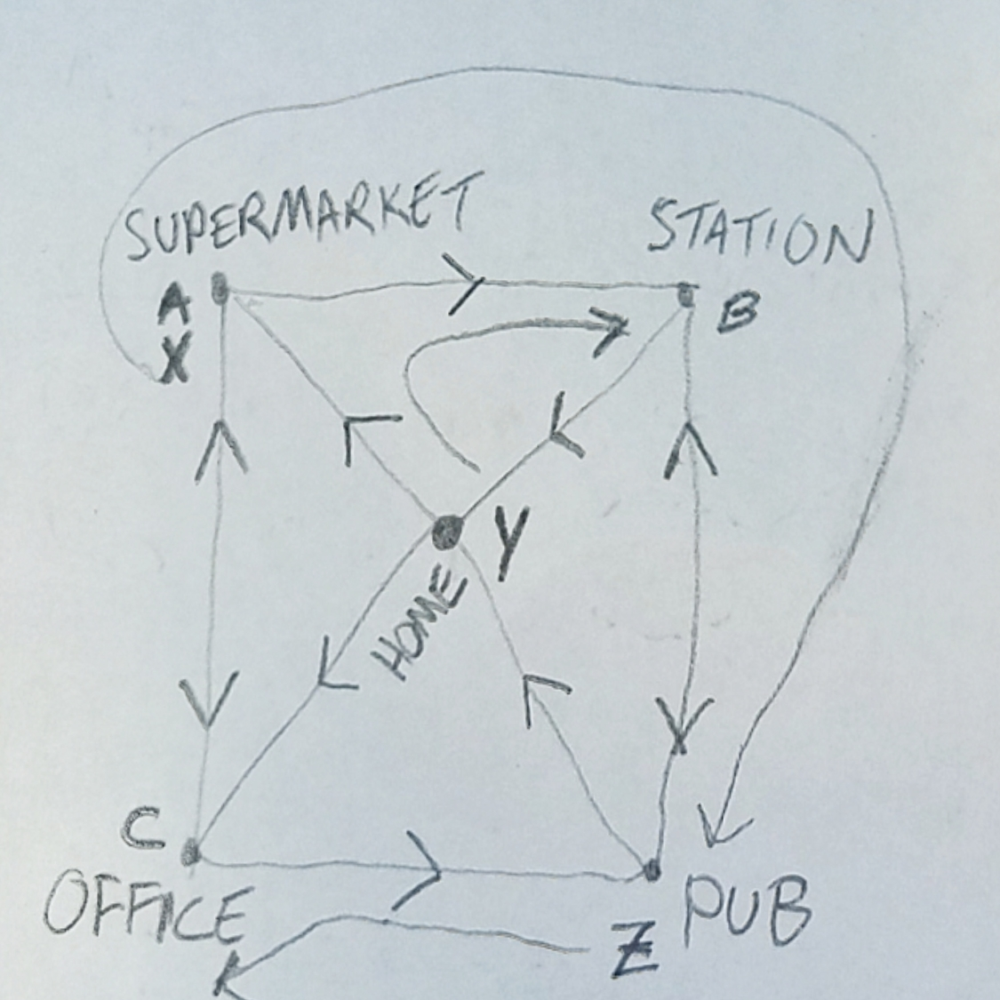

# RoutePlanning

A code challenge exercise in planning the routes for taxi cars.

## Challenge
A town is represented as a directed graph, with vertices being _locations_, and edges being _roads_.
In locations around this town you have several cars, which can travel to other locations along connecting roads.
In locations around this town are several customers, each of whom wishes to travel to a specific destination.

Clone this repository and implement the `Resolve` method in the `RoutePlanningService` class, to ensure that all customers have reached their destination. The `customer.IsSatisfied()` method will return `true` when a customer is at their destination.

You can only interact with the scenario by calling `Travel`, `PickUp` and `DropOff` methods on your cars.

To compete with others, try to minimise either the _total difference travelled_ by all cars, or the _longest distance travelled_ by any one car.

### Caveats
The output of each test will include the two metrics described above, and will also log the actions of every car.

Each road connection is one-way, though there may be corresponding road in the opposite direction.

Each car can hold any number of passengers.

This project is in .NET 6, so you'll need Visual Studio 2022.

This project uses nullable reference types, so objects cannot be null unless explicitly declared as nullable.

## Scenario: SimpleTown

This town has 5 locations and 3 customers. It is mainly intended as a (slightly) easier introduction.

There are two tests to complete: one gives you only a single car, the other gives you three.

A scrawled diagram of this network is shown below:

## Secnario: RingTown

This town has a 4x4 grid of 16 locations, with roads between most adjacent locations, and also a clockwise ring road connecting the 4 corner locations.

There is a single test to complete, with 13 customers and 5 cars.

A scrawled diagram of this network is shown below:

